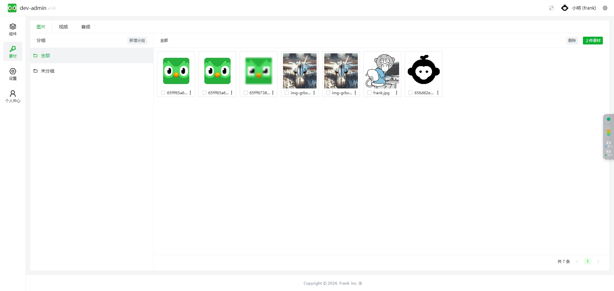
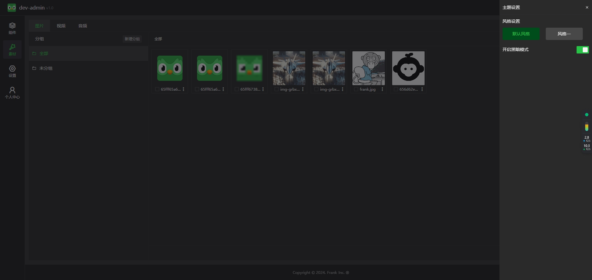
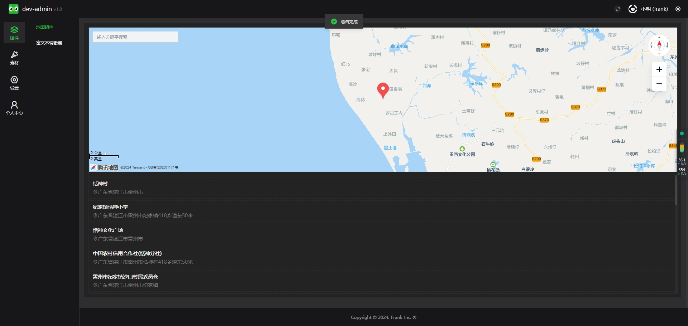
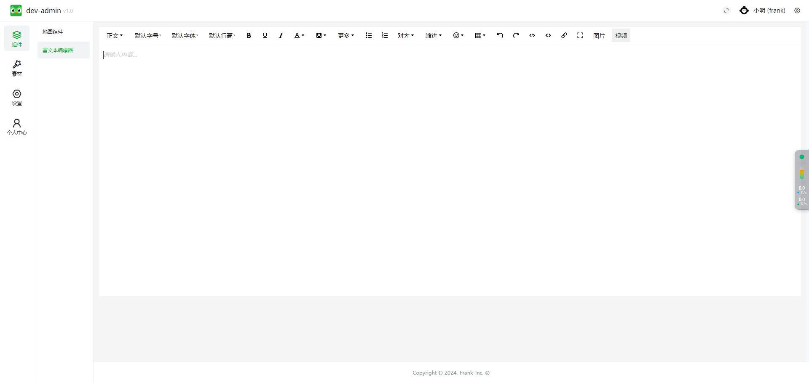
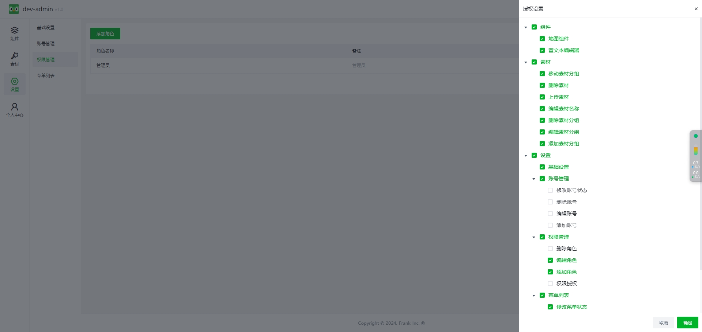

dev-admin
===============

## 特性

* PHP8 thinkphp8 mysql
* vue3 typescript vite arco-design

## Demo

演示：http://admin.dev-frank.cn/

~~~
admin
123456
~~~

## 服务端安装

~~~
composer require
~~~

导入数据库

~~~
php think migrate:run
~~~

开启目录'写入'权限
runtime
public/uploads

启动服务

~~~
php think run
~~~

## web安装

~~~
yarn install
~~~
开发

~~~
yarn dev 
~~~
发布

~~~
yarn build 
~~~

## Nginx配置

~~~
location / {
  if (!-e $request_filename){
  	rewrite ^/(.*)$ /index.php/$1 last;
  	break;
  }
}
~~~

